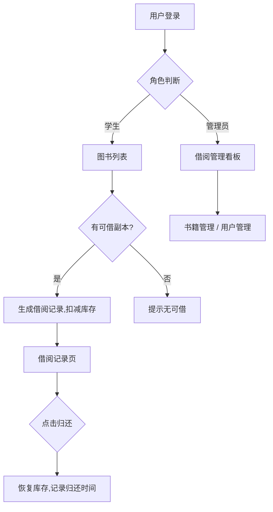

# 青檀图书馆借阅管理系统 — 产品需求文档（PRD）

## 1. 产品概述
青檀图书馆（qingtan-library）是面向校园的图书借阅管理系统，学生可在线查书、借书、还书，管理员可维护书籍与用户并总览借阅情况。
- 解决传统人工登记效率低、藏书状态不透明的痛点，面向学生与图书管理员两类角色。
- 目标是让借阅流程数字化、可追溯，提升校园图书馆的服务体验与管理效率。

## 2. 核心功能

### 2.1 用户角色
| 角色 | 注册方式 | 核心权限 |
|------|---------------------|------------------|
| 学生（student） | 管理员后台创建账号 | 查书、借书、还书、查看个人借阅记录与个人信息 |
| 管理员（admin） | 系统预置账号 | 书籍 CRUD、用户 CRUD、借阅总览与归还、数据统计 |

### 2.2 功能模块
**前台（学生）3 个页面：**
1. **图书列表**：分页浏览、关键字搜索、分类筛选、书籍卡片、借书入口、库存状态。
2. **借阅记录**：我的借阅列表、借阅/到期/归还状态、归还操作、逾期提示。
3. **个人中心**：个人信息卡片、借阅统计、最近借阅、修改密码。

**后台（管理员）3 个页面：**
4. **书籍管理**：书籍表格、新增/编辑/删除、库存与可借数维护。
5. **用户管理**：用户表格、新增/编辑/删除、角色与密码重置。
6. **借阅管理**：数据看板（藏书/用户/在借/逾期）、全部借阅记录、代归还、状态筛选。

### 2.3 页面详情
| 页面名称 | 模块名称 | 功能描述 |
|-----------|-------------|---------------------|
| 图书列表 | 搜索筛选栏 | 关键字 + 分类下拉筛选，分页 |
| 图书列表 | 书籍卡片网格 | 封面色块、书名、作者、分类、可借数、借阅按钮 |
| 借阅记录 | 记录列表 | 借阅日、到期日、状态标签、归还按钮 |
| 个人中心 | 信息卡片 | 姓名/学号(用户名)/角色/邮箱、借阅统计 |
| 个人中心 | 修改密码 | 旧密码 + 新密码校验 |
| 书籍管理 | 数据表格 | 行内编辑入口、删除确认、新增弹窗 |
| 用户管理 | 数据表格 | 角色 select、密码重置、新增/删除 |
| 借阅管理 | 看板卡片 | 总藏书/总用户/在借/逾期四张统计卡 |
| 借阅管理 | 记录表格 | 全部借阅、状态筛选、代归还 |

## 3. 核心流程

学生借阅流程：登录 → 浏览/搜索图书 → 点击借阅 → 系统扣减可借数并生成借阅记录（默认 30 天到期）→ 在借阅记录中查看 → 点击归还 → 系统恢复可借数并记录归还时间。

管理员维护流程：管理员登录 → 书籍管理新增/编辑书籍 → 用户管理创建学生账号 → 借阅管理查看在借与逾期并代归还。

## 4. 用户界面设计

### 4.1 设计风格
- 主色：深墨绿 `#1F3D2B`（藏书封面墨色），辅助：暖纸 `#F6F1E6`、黄铜 `#A8743A`、炭墨文字 `#2A2620`。
- 按钮：圆角矩形、主色实底 + 黄铜描边次按钮，卡片带柔和暖色阴影。
- 字体：标题用 Noto Serif SC（衬线学术风），正文用 Noto Sans SC；数字用等宽。
- 布局：顶部导航 + 卡片网格（前台），侧边导航 + 数据表格（后台）。
- 图标：lucide 图标，线性克制风格。

### 4.2 页面设计概览
| 页面名称 | 模块名称 | UI 元素 |
|-----------|-------------|-------------|
| 图书列表 | 搜索筛选栏 | 黄铜描边输入框、分类胶囊、分页器 |
| 图书列表 | 书籍卡片 | 封面色块 + 衬线书名 + 借阅按钮 |
| 借阅记录 | 记录行 | 状态色签 + 到期倒计时 + 归还按钮 |
| 个人中心 | 信息卡 | 头像首字母 + 统计数字 + 修改密码表单 |
| 书籍管理 | 表格 | 行操作按钮、新增抽屉 |
| 用户管理 | 表格 | 角色标签、重置密码 |
| 借阅管理 | 看板 | 4 张统计卡 + 借阅表格 |

### 4.3 响应式
桌面优先（≥1024px），平板（768-1024px）卡片网格自适应列数，移动端（<768px）导航折叠为汉堡菜单、表格横向滚动。

### 4.4 3D 场景
不适用（纯 2D 界面）。
