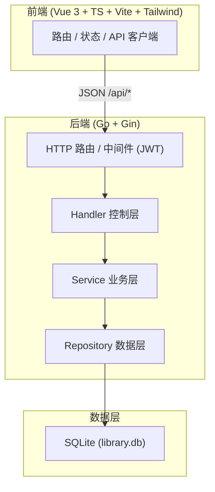
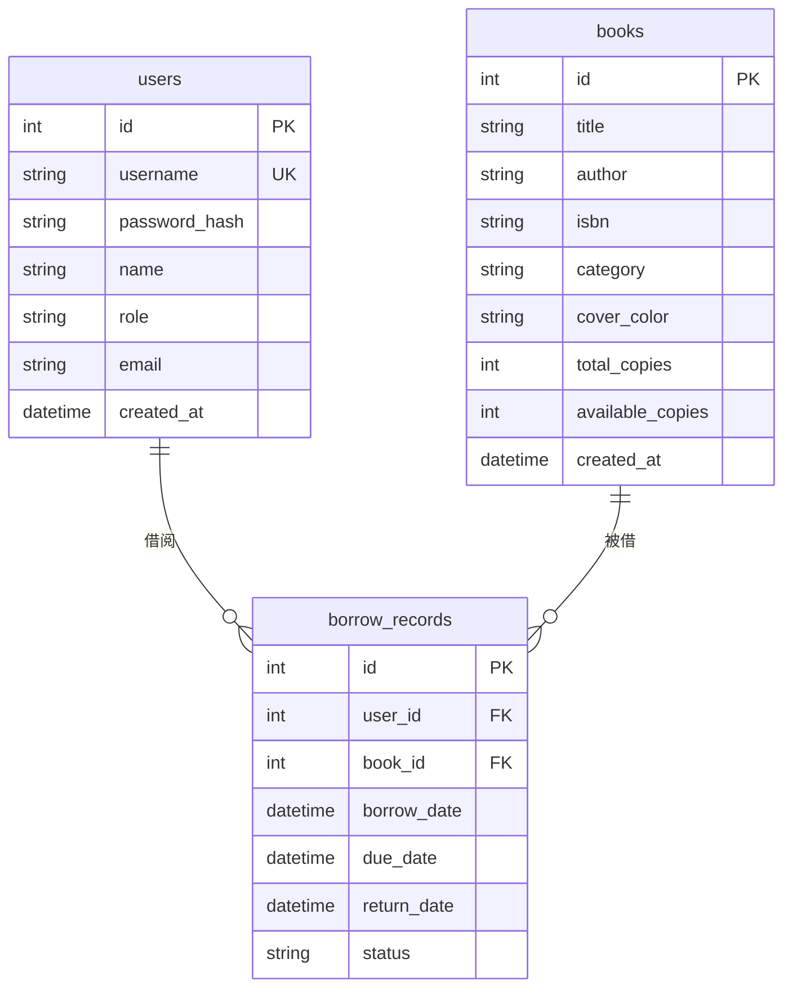

# 青檀图书馆借阅管理系统 — 技术架构文档

## 1. 架构设计



## 2. 技术说明
- 前端：Vue@3 + TypeScript + Vite + Vue Router + Tailwind CSS（vue-ts 模板）。
- 初始化工具：vite-init（pnpm）。
- 后端：Go 1.23 + Gin + golang-jwt/v5 + bcrypt + modernc.org/sqlite（纯 Go，免 CGO）。
- 数据库：SQLite（复用现有 library.db，含 admin/admin123 与 12 本藏书种子数据）。
- 通信：REST + JSON，统一响应信封 `{code, msg, data}`，code=0 成功。

## 3. 路由定义
| 路由 | 用途 | 角色 |
|-------|---------|------|
| /login | 登录页 | 公开 |
| /books | 图书列表 | 学生 |
| /borrows | 借阅记录 | 学生 |
| /profile | 个人中心 | 学生 |
| /admin/books | 书籍管理 | 管理员 |
| /admin/users | 用户管理 | 管理员 |
| /admin/borrows | 借阅管理 | 管理员 |

## 4. API 定义

统一信封：`{ code:number, msg:string, data:any }`，错误时 code≠0。

| 方法 | 路径 | 说明 | 鉴权 |
|------|------|------|------|
| GET | /api/health | 健康检查 | 公开 |
| POST | /api/auth/login | 登录，返回 token+user | 公开 |
| GET | /api/auth/me | 当前用户 | 登录 |
| GET | /api/books | 图书列表（page,pageSize,keyword,category） | 登录 |
| GET | /api/books/categories | 分类列表 | 登录 |
| GET | /api/books/:id | 图书详情 | 登录 |
| POST | /api/books | 新增图书 | 管理员 |
| PUT | /api/books/:id | 更新图书 | 管理员 |
| DELETE | /api/books/:id | 删除图书 | 管理员 |
| GET | /api/borrows | 借阅列表（page,pageSize,status,userId,mine） | 登录 |
| POST | /api/borrows | 借书 {book_id} | 登录 |
| POST | /api/borrows/:id/return | 还书 | 登录 |
| GET | /api/users | 用户列表 | 管理员 |
| POST | /api/users | 新增用户 | 管理员 |
| PUT | /api/users/:id | 更新用户 | 管理员 |
| DELETE | /api/users/:id | 删除用户 | 管理员 |
| GET | /api/stats | 看板统计 | 管理员 |

```ts
// 响应信封
interface ApiRes<T> { code: number; msg: string; data: T }
interface User { id: number; username: string; name: string; role: 'admin'|'student'; email: string; created_at: string }
interface Book { id: number; title: string; author: string; isbn: string; category: string; description: string; cover_color: string; publisher: string; published_year: number; total_copies: number; available_copies: number; created_at: string }
interface Borrow { id: number; user_id: number; book_id: number; borrow_date: string; due_date: string; return_date: string|null; status: 'borrowed'|'returned'|'overdue'; user?: User; book?: Book }
interface Stats { total_books: number; total_copies: number; available_copies: number; total_users: number; active_borrows: number; overdue_borrows: number; categories: {category:string;count:number}[] }
```

## 5. 服务端架构图


## 6. 数据模型

### 6.1 ER 图



### 6.2 DDL
```sql
CREATE TABLE IF NOT EXISTS users (
    id INTEGER PRIMARY KEY AUTOINCREMENT,
    username TEXT NOT NULL UNIQUE,
    password_hash TEXT NOT NULL,
    name TEXT NOT NULL,
    role TEXT NOT NULL DEFAULT 'student',
    email TEXT DEFAULT '',
    created_at DATETIME NOT NULL DEFAULT CURRENT_TIMESTAMP
);
CREATE TABLE IF NOT EXISTS books (
    id INTEGER PRIMARY KEY AUTOINCREMENT,
    title TEXT NOT NULL, author TEXT NOT NULL, isbn TEXT DEFAULT '',
    category TEXT DEFAULT '', description TEXT DEFAULT '',
    cover_color TEXT DEFAULT '#1F3D2B', publisher TEXT DEFAULT '',
    published_year INTEGER DEFAULT 0,
    total_copies INTEGER NOT NULL DEFAULT 1,
    available_copies INTEGER NOT NULL DEFAULT 1,
    created_at DATETIME NOT NULL DEFAULT CURRENT_TIMESTAMP
);
CREATE TABLE IF NOT EXISTS borrow_records (
    id INTEGER PRIMARY KEY AUTOINCREMENT,
    user_id INTEGER NOT NULL, book_id INTEGER NOT NULL,
    borrow_date DATETIME NOT NULL DEFAULT CURRENT_TIMESTAMP,
    due_date DATETIME NOT NULL, return_date DATETIME,
    status TEXT NOT NULL DEFAULT 'borrowed',
    FOREIGN KEY (user_id) REFERENCES users(id),
    FOREIGN KEY (book_id) REFERENCES books(id)
);
CREATE INDEX IF NOT EXISTS idx_books_category ON books(category);
CREATE INDEX IF NOT EXISTS idx_borrows_user ON borrow_records(user_id);
CREATE INDEX IF NOT EXISTS idx_borrows_status ON borrow_records(status);
```

种子：admin/admin123（管理员）、zhangsan/lisi/wangwu（学生，密码 student123）、12 本藏书。
